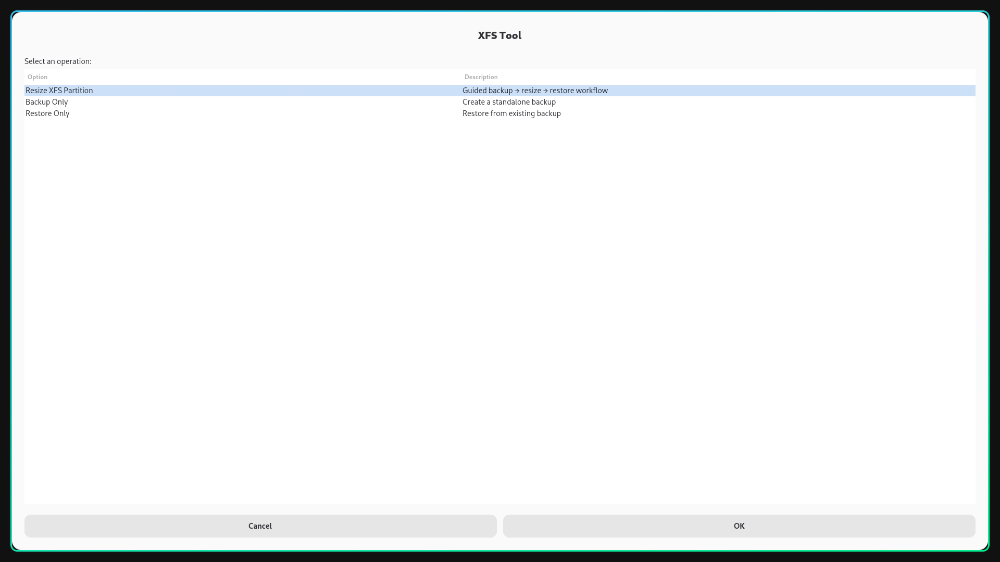

# XFS Resize Tool

<p align="center">
  
</p>

A professional, GUI-based tool for resizing XFS partitions on Arch Linux with Hyprland. Features an integrated workflow that guides you through backup, resize, and restore operations safely and intuitively.

## ✨ Features

- **🔄 Guided Resize Workflow** - Integrated 5-step wizard connects backup → resize → restore
- **💾 Standalone Backup** - Create compressed or uncompressed XFS dumps
- **📦 Standalone Restore** - Restore from existing backups
- **🎨 Beautiful GUI** - Modern Zenity-based interface designed for Wayland/Hyprland
- **✅ Safety First** - Multiple confirmations, filesystem verification, automatic unmounting
- **📊 Progress Tracking** - Visual progress bars and step indicators
- **🛠️ Flexible Tools** - Choose between cfdisk (friendly) or parted (advanced)
- **📝 State Management** - Tracks operations and can detect interrupted sessions

## 🎯 Why This Tool?

Traditional XFS resizing requires manually orchestrating multiple steps:
1. Remember to backup first
2. Unmount the partition
3. Resize with a partitioning tool
4. Format the partition
5. Remember where you saved the backup
6. Restore the data

**This tool connects all these steps into one guided workflow** so you can't forget critical steps or lose track of your backup.

## 📸 Screenshots

### Main Menu
<p align="center">
  
</p>

*Choose between guided resize workflow or standalone backup/restore*

### Resize Workflow - Intro
<p align="center">
  
</p>

*The wizard explains what will happen in 4 steps*

### Partition Selection
<p align="center">
  
</p>

*Clean partition list showing size, filesystem, and mount points*

### Step-by-Step Progress
- **Step 1/5**: Select partition to resize
- **Step 2/5**: Create backup (with compression choice)
- **Step 3/5**: Resize partition (cfdisk or parted)
- **Step 4/5**: Format as XFS
- **Step 5/5**: Restore data

Each step includes clear instructions and confirmations.

## 📋 Prerequisites

### System Requirements
- **OS**: Arch Linux (or Arch-based distro)
- **Desktop**: Hyprland (or any Wayland/X11 compositor that supports Zenity)
- **Filesystem**: XFS partitions

### Required Packages
```bash
sudo pacman -S xfsprogs parted util-linux jq pv zenity
```

**Package breakdown:**
- `xfsprogs` - XFS filesystem utilities (xfsdump, xfsrestore, mkfs.xfs)
- `parted` - Partition manipulation tool
- `util-linux` - Provides lsblk and other disk utilities
- `jq` - JSON processor for state management
- `pv` - Pipe viewer for progress monitoring
- `zenity` - GUI dialog toolkit

## 🚀 Installation

### Method 1: Quick Install (Recommended)

```bash
# Clone the repository
git clone https://github.com/yourusername/xfs-resize-tool.git
cd xfs-resize-tool

# Install dependencies
sudo pacman -S xfsprogs parted util-linux jq pv zenity

# Make executable
chmod +x xfs-resize-tool.sh

# Run the tool
./xfs-resize-tool.sh
```

### Method 2: System-Wide Installation

```bash
# Clone and navigate
git clone https://github.com/yourusername/xfs-resize-tool.git
cd xfs-resize-tool

# Install dependencies
sudo pacman -S xfsprogs parted util-linux jq pv zenity

# Install to system
sudo cp xfs-resize-tool.sh /usr/local/bin/xfs-resize
sudo chmod +x /usr/local/bin/xfs-resize

# Run from anywhere
xfs-resize
```

### Method 3: AUR Package (Coming Soon)

```bash
yay -S xfs-resize-tool-git
```

## 📖 Usage

### Guided Resize Workflow (Recommended for Resizing)

This is the main feature - a complete guided workflow for resizing XFS partitions:

```bash
./xfs-resize-tool.sh
```

1. Select **"Resize XFS Partition"**
2. Follow the 5-step wizard:
   - **Step 1**: Select the partition you want to resize
   - **Step 2**: Create a backup (choose compressed or uncompressed)
   - **Step 3**: Resize the partition using cfdisk or parted
   - **Step 4**: Confirm formatting the resized partition as XFS
   - **Step 5**: Restore your data from the backup

The tool will show you:
- Old size vs new size
- Backup location (so you can delete it later)
- Success confirmation

### Standalone Backup

Create a backup without resizing:

```bash
./xfs-resize-tool.sh
```

1. Select **"Backup Only"**
2. Choose source partition
3. Select backup location
4. Choose compression mode (compressed recommended)

**Output**: `xfs-backup-YYYYMMDD-HHMMSS.dump`

### Standalone Restore

Restore from an existing backup:

```bash
./xfs-resize-tool.sh
```

1. Select **"Restore Only"**
2. Choose backup file
3. Select target partition
4. Confirm (target will be formatted if not XFS)

## 🎓 Example Workflow

**Scenario**: Resize `/dev/nvme0n1p2` from 100GB to 200GB

### Using the Guided Workflow

1. **Launch tool**
   ```bash
   ./xfs-resize-tool.sh
   ```

2. **Select "Resize XFS Partition"**

3. **Step 1**: Select `/dev/nvme0n1p2` from the partition list

4. **Step 2**: Backup created
   - Save to: `/home/user/backups/xfs-backup-20260208-073000.dump`
   - Mode: Compressed (recommended)
   - Progress bar shows backup creation

5. **Step 3**: Resize partition
   - Tool opens `cfdisk /dev/nvme0n1`
   - Delete the partition
   - Create new 200GB partition with same number
   - Write changes and quit

6. **Step 4**: Format confirmation
   - Type "YES" to format as XFS
   - Progress bar shows formatting

7. **Step 5**: Restore
   - Automatic restore from backup
   - Progress bar shows restoration

8. **Success!**
   ```
   🎉 SUCCESS!
   
   Your XFS partition has been resized!
   
   Old size: 100GB
   New size: 200GB
   Partition: /dev/nvme0n1p2
   
   Backup saved at:
   /home/user/backups/xfs-backup-20260208-073000.dump
   
   (You can delete the backup once you verify everything works)
   ```

## ⚙️ Configuration

### Environment Variables

The tool automatically configures Wayland/X11 environment, but you can override:

```bash
# For X11
export DISPLAY=:0

# For Wayland
export WAYLAND_DISPLAY=wayland-0
export XDG_RUNTIME_DIR=/run/user/$(id -u)
```

### State File

The tool saves progress to `/tmp/xfs-resize-state.json` for tracking multi-step operations.

## 🔧 Advanced Usage

### Custom Backup Locations

When creating backups, you can save to:
- Local disk: `/home/user/backups/`
- External drive: `/mnt/external/backups/`
- Network share: `/mnt/nas/backups/`

### Partition Tools

**cfdisk** (Recommended for beginners):
- Interactive, visual interface
- Easy to see partition layout
- Color-coded partition types

**parted** (Advanced users):
- Command-line interface
- Scriptable operations
- More granular control

Common parted commands:
```
print              # Show partition table
resizepart 2 200GB # Resize partition 2 to 200GB
quit               # Exit parted
```

## ⚠️ Safety & Best Practices

### Before Resizing

✅ **DO**:
- Verify you have enough space for the backup
- Test on non-critical data first
- Have a live USB ready as a safety net
- Close all applications using the partition
- Verify the partition is actually XFS: `lsblk -f`

❌ **DON'T**:
- Resize your root partition while booted from it
- Resize without backing up first
- Delete the backup immediately
- Resize partitions containing critical system files

### During Resize

- The tool will automatically unmount partitions
- Don't interrupt the backup or restore process
- Wait for progress bars to complete
- Read all confirmation dialogs carefully

### After Resize

- Verify your data is intact before deleting the backup
- Check filesystem health: `sudo xfs_repair -n /dev/sdX`
- Update `/etc/fstab` if partition UUIDs changed
- Reboot to ensure everything mounts correctly

## 🐛 Troubleshooting

### "Missing required tools"

**Problem**: Dependencies not installed

**Solution**:
```bash
sudo pacman -S xfsprogs parted util-linux jq pv zenity
```

### "Failed to mount partition"

**Problem**: Partition is in use

**Solution**:
```bash
# Find processes using the partition
sudo lsof | grep /dev/sdX

# Close applications or reboot
```

### "Backup file not created"

**Problem**: Insufficient disk space or permissions

**Solution**:
```bash
# Check available space
df -h

# Ensure write permissions
ls -la /path/to/backup/directory
```

### "Partition disappeared after resize"

**Problem**: Partition was deleted instead of resized

**Solution**:
- Your backup is safe!
- Create a new partition with desired size
- Format as XFS: `sudo mkfs.xfs /dev/sdX`
- Restore from backup using "Restore Only" mode

### Zenity dialogs not appearing

**Problem**: Wayland/X11 display not set

**Solution**:
```bash
# Set display variables
export DISPLAY=:0
export WAYLAND_DISPLAY=wayland-0
export XDG_RUNTIME_DIR=/run/user/$(id -u)

# Then run the tool
./xfs-resize-tool.sh
```

## 🔒 Security Considerations

- The tool requires `sudo` for partition operations
- Review the code before running with elevated privileges
- Backups are unencrypted by default
- State file in `/tmp` is readable by root and user

**For encrypted backups**:
```bash
# Encrypt after backup
gpg -c xfs-backup-20260208.dump

# Decrypt before restore
gpg -d xfs-backup-20260208.dump.gpg > xfs-backup-20260208.dump
```

## 🤝 Contributing

Contributions are welcome! Here are ways you can help:

- 🐛 Report bugs or issues
- 💡 Suggest new features
- 📝 Improve documentation
- 🧪 Add test cases
- 🎨 Improve UI/UX
- 🌍 Add translations

### Development Setup

```bash
# Fork and clone
git clone https://github.com/yourusername/xfs-resize-tool.git
cd xfs-resize-tool

# Create a feature branch
git checkout -b feature/amazing-feature

# Make changes and test
./xfs-resize-tool.sh

# Commit and push
git add .
git commit -m "Add amazing feature"
git push origin feature/amazing-feature

# Open a pull request
```

### Coding Standards

- Use `set -euo pipefail` for strict error handling
- Add comments for complex logic
- Follow existing code style
- Test on Arch Linux + Hyprland
- Update documentation for new features

## 📝 License

This project is licensed under the MIT License - see the [LICENSE](LICENSE) file for details.

## 🙏 Acknowledgments

- **xfsprogs team** - For the excellent XFS tools
- **Zenity developers** - For the GUI toolkit
- **Arch Linux community** - For the amazing distro
- **Hyprland** - For the modern Wayland compositor

## 📞 Support

- **Issues**: [GitHub Issues](https://github.com/yourusername/xfs-resize-tool/issues)
- **Discussions**: [GitHub Discussions](https://github.com/yourusername/xfs-resize-tool/discussions)
- **Wiki**: [Project Wiki](https://github.com/yourusername/xfs-resize-tool/wiki)

## 🗺️ Roadmap

### Planned Features

- [ ] **Resume capability** - Continue interrupted operations
- [ ] **Automatic partition resize** - No manual cfdisk/parted needed
- [ ] **Non-destructive grow** - Use `xfs_growfs` when only growing
- [ ] **Batch operations** - Resize multiple partitions
- [ ] **Backup management** - List, verify, delete old backups
- [ ] **Dry-run mode** - Preview operations without executing
- [ ] **SSH support** - Resize partitions on remote systems
- [ ] **Notification support** - Desktop notifications for long operations
- [ ] **Logging** - Detailed operation logs
- [ ] **Theme support** - Customize Zenity appearance

### Future Enhancements

- AUR package for easy installation
- Support for other filesystems (ext4, btrfs)
- GUI progress for xfsdump/xfsrestore
- Automatic filesystem health checks
- Integration with system backup tools
- Multi-language support

## 📊 Comparison with Alternatives

| Feature | XFS Resize Tool | GParted | Manual Process |
|---------|----------------|---------|----------------|
| Guided workflow | ✅ | ❌ | ❌ |
| Integrated backup | ✅ | ❌ | ❌ |
| XFS-specific | ✅ | ❌ | ✅ |
| Progress tracking | ✅ | ✅ | ❌ |
| Wayland support | ✅ | ⚠️ | N/A |
| Command-line friendly | ✅ | ❌ | ✅ |
| Beginner-friendly | ✅ | ✅ | ❌ |
| Safety confirmations | ✅ | ⚠️ | ❌ |

## 📚 Additional Resources

- [XFS Documentation](https://xfs.org/)
- [Arch Wiki: XFS](https://wiki.archlinux.org/title/XFS)
- [Parted Documentation](https://www.gnu.org/software/parted/manual/)
- [Hyprland Documentation](https://wiki.hyprland.org/)

## 📄 Files in This Repository

```
xfs-resize-tool/
├── xfs-resize-tool.sh      # Main script
├── README.md               # This file
├── IMPROVEMENTS.md         # Detailed improvement documentation
├── COMPARISON.md           # Visual workflow comparison
├── LICENSE                 # MIT License
└── screenshots/            # GUI screenshots
    ├── main-menu.png
    ├── resize-intro.png
    └── partition-selection.png
```

---

<p align="center">
  Made with ❤️ for the Arch Linux + Hyprland community
</p>

<p align="center">
  <a href="#-features">Features</a> •
  <a href="#-installation">Installation</a> •
  <a href="#-usage">Usage</a> •
  <a href="#-contributing">Contributing</a> •
  <a href="#-support">Support</a>
</p>
